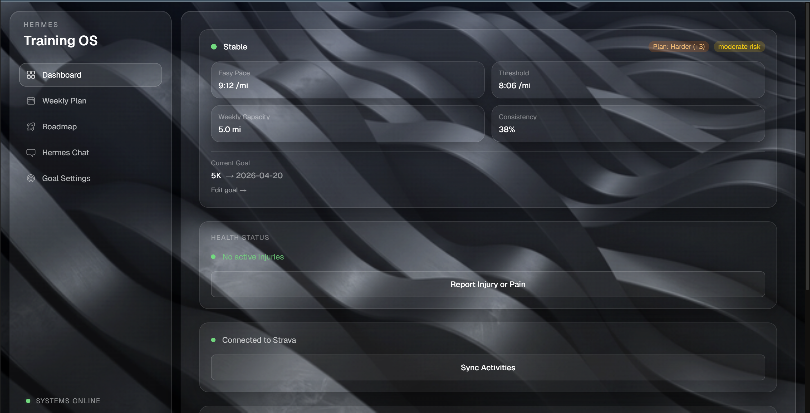

<div align="center">
  
</div>

# Hermes

Adaptive running coach that turns Strava history into safe, personalized weekly training plans, then adjusts those plans with coaching logic and AI-assisted edits.

## Why Hermes

Most running plans are static. Hermes is designed to adapt:

- Syncs real Strava activity data
- Calibrates pace and capacity from your running history
- Builds weekly plans from proven templates
- Enforces safety constraints before publishing
- Adjusts recommendations using compliance, health, and training state
- Supports natural-language plan edits through Hermes Chat

## Core Features

- Strava OAuth sign-in and activity sync
- Goal setup and onboarding flow
- Adaptive weekly plan generation and regeneration
- Roadmap phases with milestone checkpoints
- Route map view for recent Strava activities
- AI chat assistant for training edits and questions
- Health status and injury-reporting workflow

## Tech Stack

<div align="left">
  <a href="https://nextjs.org/"></a>
  <a href="https://www.typescriptlang.org/"></a>
  <a href="https://www.postgresql.org/"></a>
  <a href="https://www.prisma.io/"></a>
  <a href="https://ai.google.dev/"></a>
  <a href="https://tailwindcss.com/"></a>
</div>

## Product Walkthrough

### 1) Login and Strava Integration


The landing flow focuses on one action: connect with Strava. Once connected, Hermes can ingest activity history and initialize runner calibration.

### 2) Dashboard Overview


The dashboard surfaces the operational state of training in one place: runner state, key pace metrics, weekly capacity, consistency, health status, and sync actions.

### 3) Goal Settings


Goal configuration drives the plan horizon and progression logic. Users can set race distance and training direction without leaving the main app shell.

### 4) Weekly Plan Generator


Weekly planning provides structured day-by-day workouts with effort context, while regeneration controls support adapting future weeks as performance changes.

### 5) Roadmap Feature


The roadmap view translates long-term training into phases and milestones, making progression visible and easier to follow over time.

### 6) Hermes Chat


Hermes Chat enables conversational plan interaction: runners can ask training questions, report issues, and request plan changes through a guided assistant.

Note: Hermes is not affiliated with or endorsed by Strava.

## Architecture (High Level)

```text
Strava Sync -> Auto Calibration -> Runner Profile
Goal Setup  -> Roadmap          -> Weekly Plan Generation
                                 -> Safety Validation + Auto-Repair
                                 -> Published Weekly Plan
Compliance + Health Signals      -> State Machine -> Next Plan Cycle
```

## Project Structure

```text
src/
  app/
    api/              # auth, sync, plans, roadmap, chat, health, onboarding
    dashboard/        # dashboard UI
    plan/             # weekly plan UI
    roadmap/          # roadmap UI
    chat/             # Hermes chat UI
    onboarding/       # onboarding and bootcamp flow
  lib/
    algorithm/        # planner, validator, repair pipeline
    slm/              # Gemini client + intent parsing
    strava/           # Strava integrations and performance analysis
    state-machine/    # adaptation states and transitions
prisma/
  schema.prisma       # data model
  seed.ts             # workout template seeding
data/
  hal-higdon/         # parsed training plan source data
```

## Getting Started

### Prerequisites

- Node.js 18+
- PostgreSQL database
- Strava API app credentials
- Gemini API key

### 1) Install dependencies

```bash
npm install
```

### 2) Configure environment

Copy `.env.example` to `.env.local`, then set values:

```env
DATABASE_URL=""
DIRECT_DATABASE_URL=""
STRAVA_CLIENT_ID=""
STRAVA_CLIENT_SECRET=""
STRAVA_REDIRECT_URI="http://localhost:3000/api/auth/strava/callback"
SESSION_SECRET=""
NEXT_PUBLIC_APP_URL="http://localhost:3000"
NEXT_PUBLIC_MAPBOX_ACCESS_TOKEN=""
GEMINI_API_KEY=""
GEMINI_MODEL="gemini-2.5-flash"
```

### 3) Initialize database

```bash
npm run db:push
npm run db:seed
```

### 4) Run locally

```bash
npm run dev
```

Open `http://localhost:3000`.

## Available Scripts

- `npm run dev` - start local dev server
- `npm run build` - production build
- `npm run start` - run production server
- `npm run test` - run test suite
- `npm run lint` - run ESLint
- `npm run db:generate` - Prisma client generation
- `npm run db:push` - push schema to database
- `npm run db:migrate` - run Prisma migrations
- `npm run db:studio` - open Prisma Studio
- `npm run db:seed` - seed workout templates
- `npm run parse-plans` - parse Hal Higdon source plans
- `npm run verify-hal-truths` - validate parsed plan data

## Current Status

Hermes is an active work in progress. Core plan generation, sync, and chat workflows are in place, with ongoing polish and fixes across UX and edge cases.

## License

MIT


